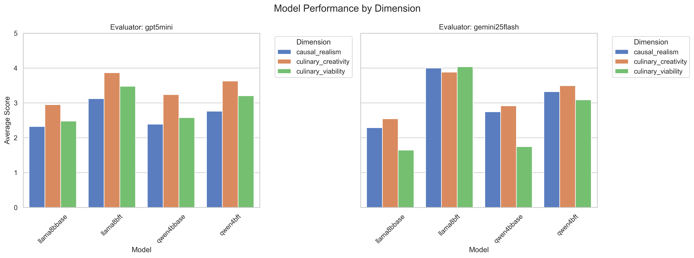
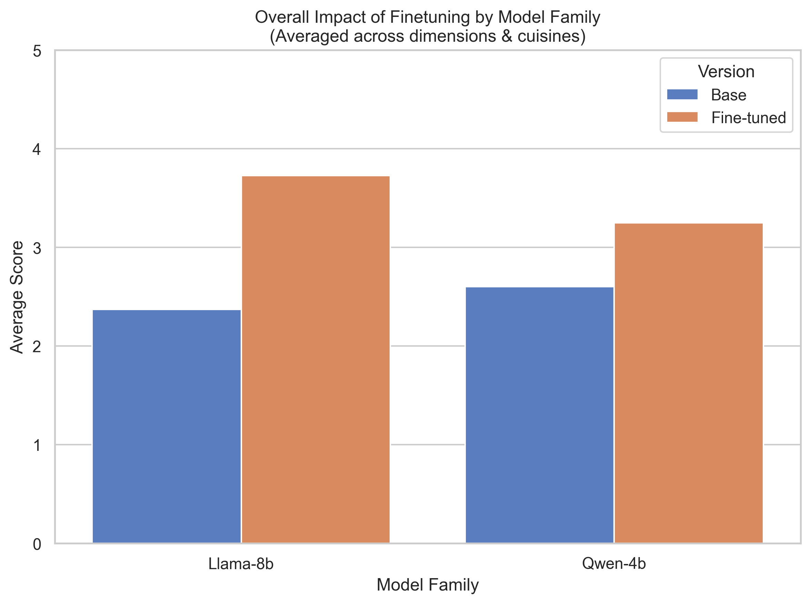
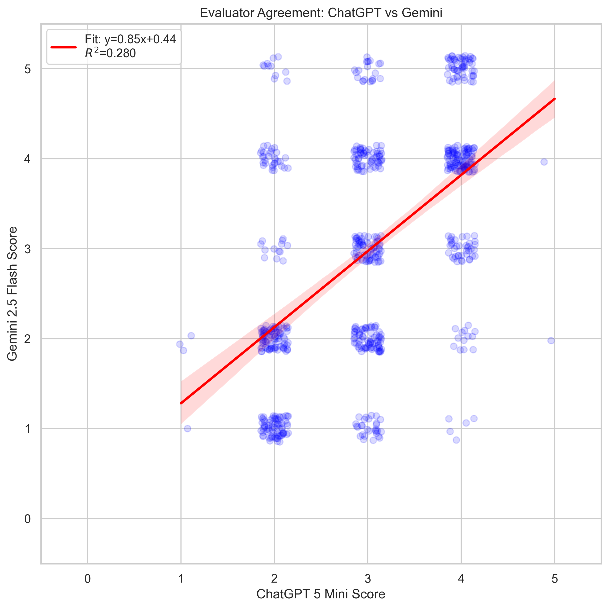
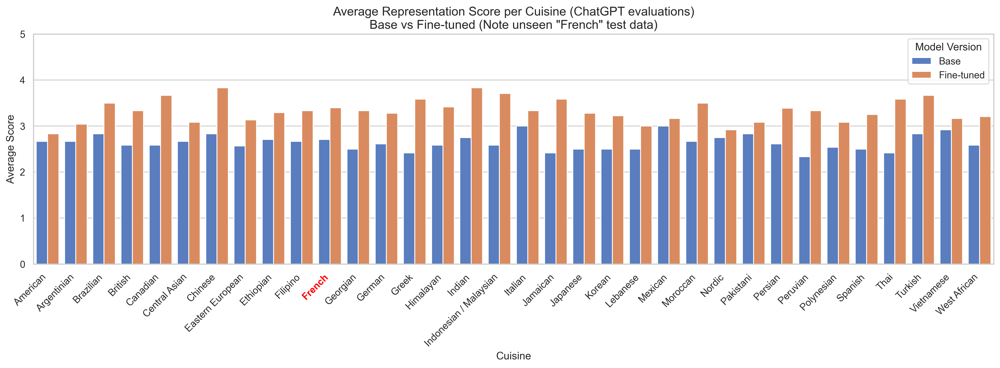
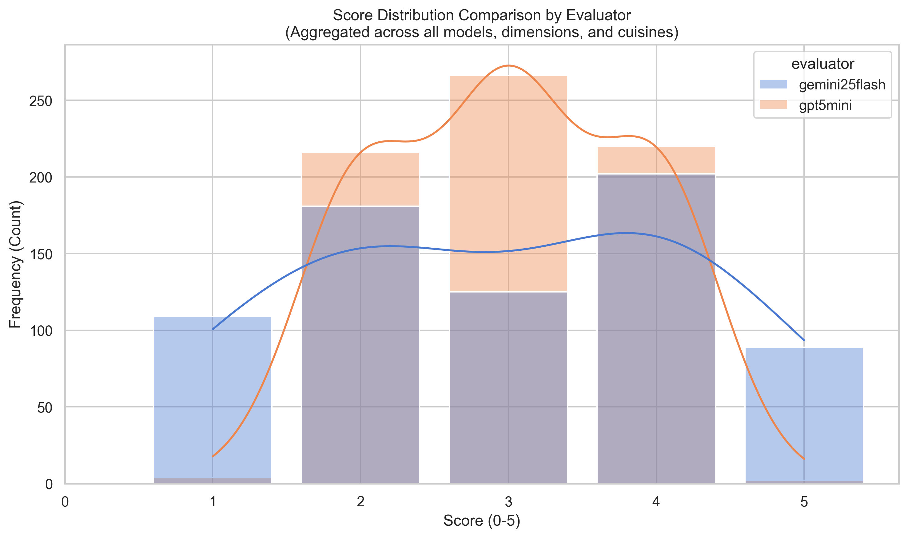

<!-- # RecipeFusion
*AI techniques to create innovative culinary fusions.*

---

## 1. Initial Research (Ingredients Only)
This phase focuses on modeling recipes using graph-based structures to understand ingredient relationships and pairings.

* **Technique:** Recipe as a Graph (Graph-based generative techniques)
* **Directory:** `/Research/InitialResearch`

---

## 2. LLM Finetuning (Ingredients + Procedure)
This phase involves training Large Language Models to handle both ingredient lists and step-by-step cooking instructions.

### A. Domain-Specific Language (DSL)
Utilizing a custom language syntax to standardize recipe representation for improved model performance and logical consistency.

* **Directory:** `/Research/RecipeDSL`
* **Directory:** `/Research/RecipeFusion`

### B. JSON Directed Acyclic Graph (DAG)
Representing the cooking process as a flow of operations to ensure logical sequencing and dependency tracking in generated recipes.

* **Directory:** `/Research/RecipeFusionv2` -->

# RecipeFusion: [Finetuning LLMs to make Recipe Fusions]

Large Language Models (LLMs) pretrained for general next token prediction **can be finetuned to gain / enhance performance on specific tasks**. **LoRA (Low Rank Adaptation)** is a specific form of finetuning that drastically reduces the number of parameters to train, while keeping all layers trainable and introducing 0 additional inference-time compute. 

In this project we seek to validate LoRA on the task of "Recipe Fusion" - fusing recipes of 2 different cuisines - requiring knowledge of base cuisines/dishes, effective fusion techniques and general recipe formulation.

---

## 📖 Overview
*   **The Goal:** To train small open source language models (Llama8b, Qwen4b etc.) to produce high quality recipe fusions (on par with LLMs like ChatGPT5) and be able to represent recipes using DAGs (Directed Acyclic Graphs).
*   **The Scope:** A representative set of 35 cuisines from all over the world was chosen. $\binom{35}{2}=561$ total examples were generated - 1 for each cuisine pair, and was divided into 502 training examples and 59 test examples. The "French" cuisine was kept completely in the test set to check for true generalizability
*   **The Impact:** We find that finetuning models with QLoRA enhances their performance in creating recipe fusions. Finetuned models gain an average of 0.75 points compared to their base models when evaluated (by teacher-LLMs) for creativity, realism and viability. 

---

## 🛠️ Procedure
1.  **Dataset Construction:** Brainstorming the initial set of cuisines. Then generating a synthetic dataset of recipe fusions using ChatGPT-5-mini.
2.  **Model Selection:** Qwen-4b, Llama-8b (Open source, relatively light weight models). The instruction-tuned variants of these models were used (so that we can do a proper before/after comparison).
3.  **Compute:** 1x NVIDIA A10 used for both training (~1.5 hrs per finetuned model) and inference
4. **Technologies:** HuggingFace TRL Library for Finetuning, vLLM serving for inference efficiency (continuous batching, KV cache management etc), PEFT - QLoRA (Parameter Efficient FineTuning - Quantized Low Rank Adaptation) for training.

---

## 📊 Results and Discussion

### 1. Overall scoring

> **Analysis:** General scores

### 2. Comparing Finetuned vs Base models

> **Analysis:** This shows that finetuning these models does indeed improve their performance on heuristic scores. Llama8b model's performance increases by an average of 1 point, whereas Qwen-4b increases by an average of 0.5 points.

### 3. Inter Annotator Agreement

> **Analysis:** Understanding the inter-annotator agreement (Evaluators are ChatGPT-5-mini (Low reasoning), and Gemini-2.5-Flash (0 thinking budget)). While a general agreement exists, we see that ChatGPT's evaluations are more centered, while Gemini's evaluations are more diffuse.

### 4. Granular impact of finetuning on each cuisine

> **Analysis:** The impact of finetuning on Recipe Fusions involving each cuisine (1 recipe fusion features twice - once for each cuisine). Any Recipe Fusion involving the French cuisine is test-only. This shows that the model has genuinely generalized its abuility to curate recipe fusions

### 4. Granular impact of finetuning on each cuisine

> **Analysis:** Distribution of scores by different evaluators. Shows that the evaluations by ChatGPT are more centered, while those of Gemini are more diffuse (larger number of 1 and 5 scores assigned).

---
## Other points to mention
- Why choose instruction tuned models over actual pretrained models?
- Inter Annotator Agreement
- Some points to note (Limitations) - Low inter annotator agreement (inherent subjectiity, annotator differences), Data generation - Teacher llm chooses the same major recipes (always Butter Chicken for Indian cuisine?!) - perhaps do not ask it to choose 'Iconic recipes', or force it to make fusions with randomly chosen recipes
- Nice next steps - Indian sub-cuisine fusion?
---

## 🍽️ Inference Example
Provide a "Golden Example" of what the model produces.

**Input Prompt:**
`[Insert a sample prompt you used during testing]`

**Model Output:**
`[Insert the actual text generated by your fine-tuned model]`

---

## 🏁 Conclusions
*   **Summary:** Did the project succeed? 
*   **Challenges:** What was the hardest part? (e.g., "The model kept hallucinating 5-hour cook times for simple salads").
*   **Next Steps:** What would you do with more compute or more data? (e.g., "Integrating a Reward Model based on human taste preferences").

---

## 📂 Repository Structure
*   `data/`: Raw and processed datasets.
*   `src/`: Training and inference Python scripts.
*   `assets/`: PNG files of your Seaborn plots.
*   `main_*.py/`: Various python main files to kick off major pipelines (training, merging, inference, evaluation etc.)

---