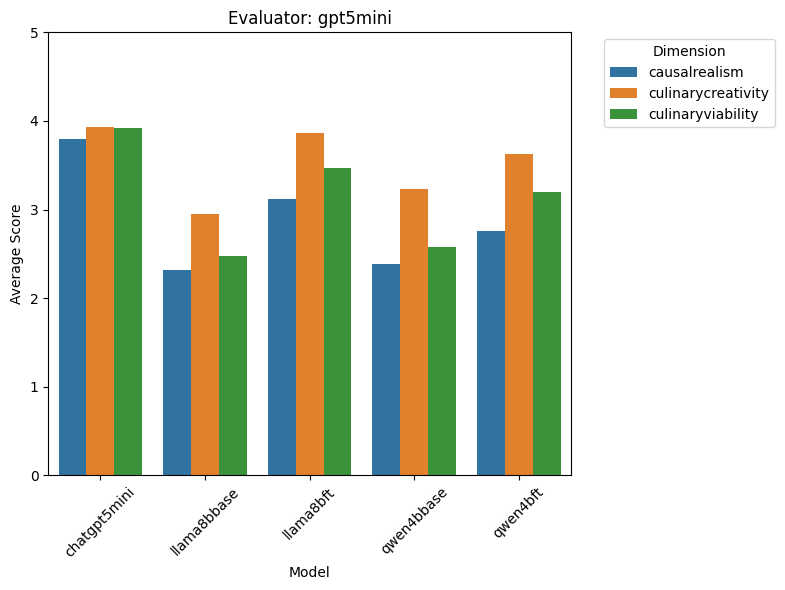
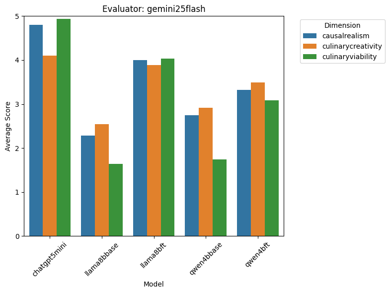
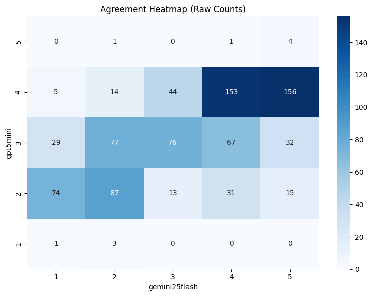
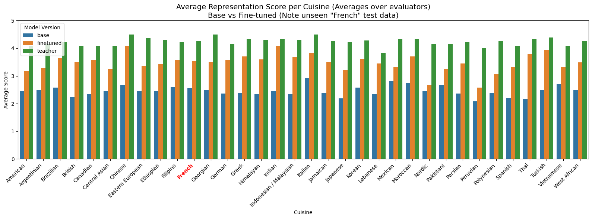
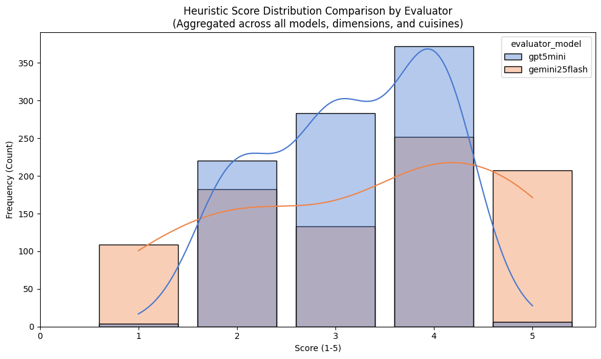

# RecipeFusion: Finetuning LLMs to make Recipe Fusions

Large Language Models (LLMs) pretrained for general next token prediction **can be finetuned to enhance performance on specific tasks**. **LoRA (Low Rank Adaptation)** is a specific form of finetuning that drastically reduces the number of parameters to train, while allowing one to keep all layers trainable and introducing 0 additional inference-time compute. 

In this project we seek to validate LoRA on the task of "Recipe Fusion" - fusing recipes of 2 different cuisines - requiring knowledge of base cuisines/dishes, effective fusion techniques and general recipe formulation.

Feel free to also check out [RecipeFusion](https://master.d5oeo15dgeb35.amplifyapp.com/) - a web application where you can query for fusions for different cuisines! Under the hood, this app performs inference on these finetuned models and visualizes the output as a recipe card. (Note - inference might take upto 5 minutes)

---

## Overview
*   **The Goal:** To train small open source language models (Llama8b, Qwen4b etc.) to produce high quality recipe fusions (on par with LLMs like ChatGPT5) and be able to represent recipes using DAGs (Directed Acyclic Graphs).
*   **The Scope:** A representative set of 34 cuisines from all over the world was chosen. Some examples include Indian, French, Brazilian, West African, Japanese, Greek etc. For each pair of cuisines, 1 fusion recipe is generated combining iconic recipes in each source cuisine. A teacher LLM (Chat GPT 5 Mini) is used for generating synthetic data. The $\binom{34}{2}=561$ examples were divided into 502 training examples and 59 test examples. The "French" cuisine in particular was kept completely in the test set to evaluate generalizability.
* **Evaluation:** How should we evaluate a fusion recipe? The evaluation is broken down into deterministic structure evaluation and a 3 dimensional heuristic evaluation using an LLM-as-a-judge technique. The deterministic portion evaluates answer format, Recipe JSON schemas and DAG validity - flagging cycles, unused ingredients / intermediate outcomes. For heuristic evaluation, we check Culinary Creativity (the novelty of the techniques used for fusion), Culinary Viability (whether the resulting fusion dish is edible/safe, and is an indeed incredible dish) and Causal Realism (whether the described steps genuinely result in the described fusion dish). Each of these dimensions is scored on a scale of 1(fail) to 5(success), with a rubric provided to provide grounding to the evaluator models.
*   **The Impact:** We find that finetuning models with QLoRA enhances their performance in creating recipe fusions. Finetuned models gain an average of 0.75 points compared to their base models when evaluated (by teacher-LLMs) for creativity, realism and viability. More in-depth discussion is presented in the Results section.

---

## Procedure
1.  **Dataset Construction:** Brainstorming the initial set of cuisines. Then generating a synthetic dataset of recipe fusions using ChatGPT-5-mini.
2.  **Model Selection:** Qwen-4b, Llama-8b (Open source, relatively light weight models). The instruction-tuned variants of these models were used (so that we can do a proper before/after comparison).
3.  **Compute:** 1x NVIDIA A10 used for both training (~1.5 hrs per finetuned model) and inference
4. **Technologies:** HuggingFace TRL Library for Finetuning, vLLM serving for inference efficiency (continuous batching, KV cache management etc), PEFT - QLoRA (Parameter Efficient FineTuning - Quantized Low Rank Adaptation) for training.

---

## Results and Discussion

We evaluate our baseline (Qwen 4b Instruction tuned (qwen4bbase), Llama 8b Instruction tuned (llama8bbase)) models as well as their finetuned (qwen4bft, llama8bft) versions. A stronger baseline (the model that generated the synthetic data) is also considered (Chat GPT 5 mini (chatgpt5mini)).

All evaluation presented here was done on test data only.

### 1. Heuristic scores Overview
<table>
  <tr>
    <td></td>
    <td></td>
  </tr>
</table>

> **Analysis:** The graphs above show the scores provided by 2 LLM-as-a-judge models Chat GPT 5 Mini (gpt5mini) and Gemini 2.5 Flash(gemini25flash) on the 3 heuristic evaluation criteria. 3 Baseline models and 2 finetuned models are evaluated on a scale of 1 (fail) to 5 (success). We can make several observations
1. The general standing of models is Llama8bBase (2.4) < Qwen4bBase (2.6) < Qwen4bFinetuned (3.2) < Llama8bFinetuned (3.7) < ChatGPT5Mini (4.2)
2. Finetuning generally improves average fusion quality, with the Qwen 4b models enjoying a 0.6 point improvement, and the Llama 8b models enjoying a much larger 1.3 point improvement. However the teacher model scores the highest, leading the best finetuned model by 0.5 points.
3. Interestingly, the base version of Llama 8b performed worse than the base version of Qwen 4b (Check Why?). However, this difference was small, at 0.3. Finetuning seems to offer greater performance benefits to the larger model - which is expected.
4. Culinary creativity was generally scored higher than Viability or Realism (Chat GPT 5 Mini as evaluator), while there is no clear pattern with Gemini 2.5 Flash as the evaluator. This may suggest a characteristic of the evaluation dimension (easier to make creative combinations, but tougher to get the quantities/physics right) or the evaluator models' interpretation of the prompts.
5. Comparing evaluators - Gemini 2.5 Flash scores Llama8bFinetuned more favourably (~ 0.5), Llama8bBase less favourably (~ 0.4), and Qwen4bBase less favourably (~ 0.3) compared to ChatGPT 5 Mini. Both models evaluate Qwen4bFinetuned similarly (about 0.1 difference). Interestingly Gemini 2.5 Flash rated the synthetic data generated by the teacher model much more faourably (~ 0.7) than ChatGPT 5 Mini (which was used to create the synthetic data, and was also one of the evaluators).

### 2. Inter Annotator Agreement

> **Analysis:** Comparing evaluators, we see a general agreement on the scores given (across all dimensions) for each test example. However, the more standard Cohen's Kappa Inter Annotator Agreement measure (which also accounts for accidental random agreement) shows a generally low agreement metric (). Observing the heatmap, this is probably due to ChatGPT generally avoiding extreme scores (1 or 5) while Gemini's scores are more diffuse. These fringe differences (156 counts scored 4 by ChatGPT but 5 by Gemini, 74 counts scored 2 by ChatGPT but 1 by Gemini) can contribute to the reduction in the Cohen's Kappa.  

### 3. Granular impact of finetuning on each cuisine

> **Analysis:** We compare Base vs Finetuned vs Teacher models' average scores over all dimensions. We see a consistent improvement in performing fusions for every cuisine (including the completely held out French cuisine). Chinese and Indian cuisines enjoy the largest improvements, while the Nordic cuisine improves only a little. A single experiment contributes its score to the 2 participating cuisines. The French cuisine also showing an improvement suggests that the model has learnt some fusion techniques, and can adapt them to new cuisines.

### 4. Granular impact of finetuning on each cuisine

> **Analysis:** Distribution of scores by different evaluators. This plot confirms that ChatGPT's evaluations are centered, while those of Gemini are more diffuse (larger number of 1 and 5 scores assigned).

---

## Other points to mention
- Why choose instruction tuned models over actual pretrained models?
  Pretrained models are simple next token prediction models and do not necessarily "follow instructions". Since we wanted to have a fair evaluation (comparing finetuned models to their base and the teacher model), we wanted to use models that could perform the required task given a suitable prompt. Thus the instruction tuned versions of these models were used.
- Inter Annotator Agreement
  The Inter Annotator Agreement between the two evaluator models is relatively low (at TODO). This could hint at ambiguous evaluation criteria / rubric or genuine evaluator differences. One striking difference between the evaluators can be seen near the extreme scores (poor (1) / excellent (5)). Chat GPT rarely scores outputs as either a 1 or a 5, but Gemini's scores are more diffuse.
---

## Conclusions
*   **Summary:**
  1) Validated the QLoRA technique of LLM finetuning to enhance performance on a custom creative task - generating Fusion Recipes.
  2) Dataset and finetuned models available on HuggingFace.
  3) We have deployed the finetuned models on AWS Sagemaker (through an Asynchronous Inference endpoint), as well as an app to view model generated outputs for custom inputs.
  4) Code for the complete pipeline present in this repository.
*   **Challenges:** 
  1) Inference usually takes ~5 minutes per example (~5000 tokens) on a single A10 GPU (since the models output the two base-cuisine recipes and then the fusion recipe). These requests would time out on AWS Sagemaker hosted instances running the DJL (Deep Java Library) inference engine. I wasn't able to find any official solution for this, but a hack discovered while browsing through the opensource implementation was to tweak an environment variable (TODO).
  2) The Synthetic Data generated has some issues. When prompted, the teacher model usually chooses the same base recipes (Ceviche for Peruvian cuisine, Jollof Rice for West African, BUtter Chicken for Indian etc.). This is perhaps because of the prompt to use 'iconic' recipes from the cuisines. This may cause a partial leakage of information into the test set.
*   **Next Steps:** 
  1) A new mode of recipe fusion  - To address Challenge #2 we can rerun the pipeline using a new mode of recipe fusion (where not only the original cuisines, but also their dishes are provided to the model). This mode would put a greater emphasis on the techniques of fusion rather than allowing the model to use safe / standard choices.
  2) Experiments on amount of training data / training passes on quality - With additional cuisines / using several dishes per cuisine, we can test experimentally the effect of training data on the quality of fusions generated. Another interesting investigation would be the effect of the number of training passes/epochs on the quality.

---

## Repository Structure
*   `main_*.py/`: Various python main files to kick off major pipelines.
    * `main_train.py/`: Train (Finetune) LLM models and save LoRA weights.
    * `main_merge.py/`: Merge the LoRA weights with the models' original weights (to give a single merged finetuned model).
    * `main_infer.py/`: vLLM inference on finetuned models.
    * `main_evaluate.py/`: Evaluation pipeline (Deterministic + Heuristic + Analysis). Includes batch mode evaluation requests to models for LLM-as-a-judge heuristic evaluation criteria.
*   `data/`: Raw and processed datasets. (TODO)
*   `src/`: Functions used by the main_* scripts.
*   `tests/`: Testing for scripts.
*   `assets/`: PNG files of generated plots.

---

## AI Acknowledgement
AI Tools (Primarily Google Gemini) have been invaluable in speeding up the write-test-refactor loops, allowing me to focus on high level problem formulation, data engineering and software engineering challenges. All code has been iteratively modified, and optimized by me to fit the system's architectural constraints.

At a more granular level:
1) Problem design - I formulated the Recipe Fusion concept (initially as a Graph Neural Network problem, but then pivoted to LLM-finetunig) while AI assisted with generating scaffolding code.
2) Data and ML Ops - Designed the synthetic data generation pipeline, conducted training experiments across Kaggle, Vast.ai and investigated API endpoints (eventually settling on Asynchronous Inference on AWS Sagemaker). AI again assisted with code, and requested iterations / refinements.
3) Evaluation - Created a standardized evaluation framework and consolidated a multi-dimensional heuristic evaluation component. AI helped flesh out the LLM-as-a-judge prompts.
4) Productionization - Restructured all experimental PoC scripts into a verified production ready pipeline. AI assisted in restructuring the code.

## Inference Example
We provide below the input prompt (common to ALL models - the Teacher (inference mode), Base models (inference mode), and Finetuned models (Inference and Training modes)).

An example test output from the finetuned Qwen 4 billion parameter model. The average heuristic scores received for this example (both evaluators, averaged over all dimensions) is 4.16 which is above average compared to other outputs from this model.

**Input Prompt:**
~~~
**Role:** You are an elite AI Fusion Chef and Culinary Architect. Your expertise lies in the molecular and cultural synthesis of disparate cuisines to create innovative, viable, and delicious dishes.

**Task:** I will provide you with two cuisines. You must:
1.  Identify one iconic dish from **Cuisine A** and one from **Cuisine B**.
2.  Provide a detailed description and a technical JSON recipe for both.
3.  Develop and explain the Fusion Strategy.
4.  Synthesize a final **Fusion Recipe** that merges the two, outputting a unique name and a full technical JSON recipe.
5.  The steps in all technical JSON recipes should conform to a Directed Acyclic Graph (DAG) structure. 

**JSON Schema Requirements:**
Every recipe must follow this exact JSON structure:
* `description`: A rich, 3-4 sentence culinary summary.
* `ingredients`: List of objects with `name`, `amount` (number/string), and `unit`.
* `steps`: List of objects. Each step MUST contain:
  * `instruction`: A natural language sentence describing the action to perform in this step. May include ingredients, containers and other descriptive language.
    * `action`: A high-level verb (e.g., "SOAK", "SAUTE", "MIX").
    * `inputs`: List of ingredient or previous result names used. Names should be exact matches with ingredient names or previous result_name.
    * `result_name`: The name of the resulting component.
    * `metadata`: A list of lists for structured metadata. Use this to highlight containers, cook times, visual cue, size of cut etc.  (e.g., `[["container", "skillet"], ["time", "5 min"]]`).

**Output Format:**
Follow this exact layout:

Original Recipes: [Dish A] ([Cuisine A]) + [Dish B] ([Cuisine B])

RecipeA:
[Dish Name]
[JSON Data]

RecipeB:
[Dish Name]
[JSON Data]

Fusion Explanation:
[Detailed paragraph explaining the culinary logic, flavor profile, and why these elements were chosen to merge.]

RecipeFusion:
[New Fusion Dish Name]
[JSON Data]

**Input Cuisines:**
Cuisine A: {CUISINE_A}
Cuisine B: {CUISINE_B}
~~~

**Model Output:**
An example output from Qwen4b finetuned is given below.
~~~
Original Recipes: Doro Wat (Ethiopian) + Butter Chicken (Indian)

RecipeA:
Doro Wat
{
  "description": "Doro Wat is Ethiopia’s iconic spicy chicken stew, slow-cooked in a deeply aromatic sauce of berbere spice and niter kibbeh (spiced clarified butter), finished with hard-boiled eggs and served with injera. The berbere blend provides a complex, warm heat and smoky depth, while niter kibbeh adds a toasty, slightly sweet richness that mellows the berbere. Long simmering reduces the sauce into a glossy, clinging coating that soaks the chicken and eggs. The dish is traditionally served with flat, spongy injera for scooping and savoring the sauce.",
  "ingredients": [
    {"name": "chicken thighs", "amount": 1.2, "unit": "kg"},
    {"name": "onion", "amount": 2, "unit": "large"},
    {"name": "garlic cloves", "amount": 8, "unit": "pieces"},
    {"name": "ginger", "amount": 30, "unit": "g"},
    {"name": "berbere spice", "amount": 100, "unit": "g"},
    {"name": "niter kibbeh", "amount": 120, "unit": "g"},
    {"name": "tomato paste", "amount": 80, "unit": "g"},
    {"name": "chicken stock", "amount": 1.2, "unit": "L"},
    {"name": "hard-boiled eggs", "amount": 6, "unit": "pieces"},
    {"name": "salt", "amount": 1.5, "unit": "tsp"},
    {"name": "black pepper", "amount": 0.5, "unit": "tsp"},
    {"name": "lime", "amount": 1, "unit": "piece"}
  ],
  "steps": [
    {
      "instruction": "Peel and roughly chop the onions and garlic, and finely grate the ginger.",
      "action": "PREPARE",
      "inputs": ["onion", "garlic cloves", "ginger"],
      "result_name": "aromatics",
      "metadata": [["size", "rough chop"], ["container", "bowl"]]
    },
    {
      "instruction": "Heat a heavy pot over medium-high heat and add niter kibbeh, melting it until fragrant and slightly darkened.",
      "action": "MELT",
      "inputs": ["niter kibbeh"],
      "result_name": "niter_kibbeh_base",
      "metadata": [["container", "heavy pot"], ["time", "3-4 min"], ["visual", "fragrant, slightly darkened"]]
    },
    {
      "instruction": "Add the chopped aromatics to the pot and sauté until the onions are translucent and the garlic and ginger are softened.",
      "action": "SAUTE",
      "inputs": ["aromatics", "niter_kibbeh_base"],
      "result_name": "sautéed_aromatics",
      "metadata": [["container", "heavy pot"], ["time", "8-10 min"], ["visual", "translucent onions"]]
    },
    {
      "instruction": "Stir in the berbere spice and tomato paste and cook until the oil separates and the spice oils bloom, about 2-3 minutes.",
      "action": "BLOOM",
      "inputs": ["sautéed_aromatics", "berbere spice", "tomato paste"],
      "result_name": "spiced_base",
      "metadata": [["container", "heavy pot"], ["time", "2-3 min"], ["visual", "oil separates"]]
    },
    {
      "instruction": "Add the chicken thighs to the pot, season with salt and black pepper, and brown the chicken on all sides until a golden crust forms.",
      "action": "BROWN",
      "inputs": ["spiced_base", "chicken thighs", "salt", "black pepper"],
      "result_name": "browned_chicken",
      "metadata": [["container", "heavy pot"], ["time", "8-10 min"], ["visual", "golden crust"]]
    },
    {
      "instruction": "Pour in the chicken stock, bring to a simmer, then reduce heat to low and cook gently until the chicken is tender, about 45-60 minutes.",
      "action": "SIMMER",
      "inputs": ["browned_chicken", "chicken stock"],
      "result_name": "simmered_doro",
      "metadata": [["container", "heavy pot"], ["time", "45-60 min"], ["visual", "tender chicken"]]
    },
    {
      "instruction": "Remove the chicken to a cutting board, shred the meat and return to the pot with the sauce, then add the hard-boiled eggs and simmer 5 minutes to meld flavors.",
      "action": "SHRED_AND_COMBINE",
      "inputs": ["simmered_doro", "hard-boiled eggs"],
      "result_name": "finished_doro",
      "metadata": [["container", "heavy pot"], ["time", "5 min"], ["visual", "sauce coats shredded chicken"]]
    },
    {
      "instruction": "Serve the finished_doro hot with injera and squeeze lime over the eggs.",
      "action": "SERVE",
      "inputs": ["finished_doro", "lime"],
      "result_name": "served_doro",
      "metadata": [["container", "plate"], ["visual", "sauce clinging to shredded chicken and eggs"]]
    }
  ]
}

RecipeB:
Butter Chicken
{
  "description": "Butter Chicken is a classic North Indian curry of tender chicken simmered in a tangy, spiced tomato-butter sauce with warm spices and yogurt. The dish balances bright acidity from yogurt and tamarind with warm, aromatic spices like garam masala and coriander. Chicken is typically marinated briefly in yogurt and spices, then gently cooked so the sauce coats the meat and develops a glossy sheen. It is traditionally served with basmati rice or naan for scooping and pairing.",
  "ingredients": [
    {"name": "chicken thighs", "amount": 1.2, "unit": "kg"},
    {"name": "yogurt", "amount": 120, "unit": "g"},
    {"name": "garlic cloves", "amount": 4, "unit": "pieces"},
    {"name": "ginger", "amount": 20, "unit": "g"},
    {"name": "turmeric", "amount": 1, "unit": "tsp"},
    {"name": "garam masala", "amount": 1.5, "unit": "tsp"},
    {"name": "salt", "amount": 1.5, "unit": "tsp"},
    {"name": "tomato paste", "amount": 60, "unit": "g"},
    {"name": "onion", "amount": 1, "unit": "large"},
    {"name": "butter", "amount": 80, "unit": "g"},
    {"name": "oil", "amount": 20, "unit": "ml"},
    {"name": "lemon juice", "amount": 1, "unit": "tbsp"},
    {"name": "fresh cilantro", "amount": 30, "unit": "g"}
  ],
  "steps": [
    {
      "instruction": "Peel and finely chop the onion, garlic, and ginger.",
      "action": "PREPARE",
      "inputs": ["onion", "garlic cloves", "ginger"],
      "result_name": "aromatics",
      "metadata": [["size", "finely chopped"], ["container", "bowl"]]
    },
    {
      "instruction": "Mix yogurt with turmeric, salt, garam masala, and half the garlic and ginger to create a marinade and coat the chicken thighs.",
      "action": "MARINATE",
      "inputs": ["yogurt", "turmeric", "salt", "garam masala", "aromatics", "chicken thighs"],
      "result_name": "marinated_chicken",
      "metadata": [["container", "bowl"], ["time", "30 min"], ["visual", "coated chicken"]]
    },
    {
      "instruction": "Heat oil in a heavy skillet over medium heat and add the remaining garlic and ginger, sauté until fragrant.",
      "action": "SAUTE",
      "inputs": ["aromatics", "oil"],
      "result_name": "sautéed_garlic_ginger",
      "metadata": [["container", "skillet"], ["time", "2-3 min"], ["visual", "fragrant"]]
    },
    {
      "instruction": "Add tomato paste to the skillet and cook until it darkens and oil separates, about 3-4 minutes.",
      "action": "COOK",
      "inputs": ["sautéed_garlic_ginger", "tomato paste"],
      "result_name": "tomato_base",
      "metadata": [["container", "skillet"], ["time", "3-4 min"], ["visual", "oil separates"]]
    },
    {
      "instruction": "Add the marinated_chicken to the skillet, sear briefly to brown the exterior, then add the onion and cook until softened.",
      "action": "SEAR_AND_COOK",
      "inputs": ["marinated_chicken", "tomato_base", "onion"],
      "result_name": "seared_chicken",
      "metadata": [["container", "skillet"], ["time", "8-10 min"], ["visual", "browned exterior"]]
    },
    {
      "instruction": "Pour in warm water or stock, bring to a simmer, then reduce heat and simmer until the chicken is tender, about 20-25 minutes.",
      "action": "SIMMER",
      "inputs": ["seared_chicken", "water or stock"],
      "result_name": "simmered_chicken",
      "metadata": [["container", "skillet"], ["time", "20-25 min"], ["visual", "tender chicken"]]
    },
    {
      "instruction": "Stir in butter and lemon juice, simmer 2-3 minutes to emulsify and brighten the sauce, then finish with chopped cilantro.",
      "action": "FINISH",
      "inputs": ["simmered_chicken", "butter", "lemon juice", "fresh cilantro"],
      "result_name": "finished_butter_chicken",
      "metadata": [["container", "skillet"], ["time", "2-3 min"], ["visual", "glossy sauce"]]
    },
    {
      "instruction": "Serve the finished_butter_chicken hot with basmati rice or naan.",
      "action": "SERVE",
      "inputs": ["finished_butter_chicken"],
      "result_name": "served_butter_chicken",
      "metadata": [["container", "plate"], ["visual", "glossy sauce over chicken"]]
    }
  ]
}

Fusion Explanation:
I fused Doro Wat and Butter Chicken to create a dish that preserves the soul of both cuisines: Doro Wat’s berbere heat, niter kibbeh richness, and long-simmered sauce; and Butter Chicken’s tangy yogurt, tamarind brightness, and buttery finish. The strategy is to layer berbere and garam masala for a balanced heat and aromatic complexity, use niter kibbeh as a foundational fat and umami element, and introduce yogurt and tamarind to provide the Indian tang and cooling contrast. Chicken is briefly marinated in a hybrid yogurt-berbere marinade to marry textures and flavors, then simmered in a combined sauce that melds berbere-tomato base with butter and yogurt to create a glossy, clinging coating. The fusion keeps the scooping vehicle (injera or rice) and finishes with cilantro and lime to bridge Ethiopian and Indian herbaceousness.

RecipeFusion:
Niter Berbere Butter Chicken with Tamarind Yogurt
{
  "description": "Niter Berbere Butter Chicken marries Ethiopian berbere and niter kibbeh with Indian yogurt, tamarind, and butter to create a glossy, tangy-spicy chicken stew. The chicken is marinated in a yogurt-berbere blend, then cooked in a niter kibbeh-butter base that is enriched with tomato and finished with tamarind yogurt for brightness. The result is a deeply aromatic, slightly sweet, and tangy sauce that clings to tender chicken and hard-boiled eggs, served with injera or basmati rice. The dish balances warm spice, toasty clarified butter, and cooling yogurt to create a harmonious cross-cultural curry.",
  "ingredients": [
    {"name": "chicken thighs", "amount": 1.2, "unit": "kg"},
    {"name": "yogurt", "amount": 120, "unit": "g"},
    {"name": "berbere spice", "amount": 70, "unit": "g"},
    {"name": "garam masala", "amount": 1.5, "unit": "tsp"},
    {"name": "niter kibbeh", "amount": 100, "unit": "g"},
    {"name": "butter", "amount": 80, "unit": "g"},
    {"name": "garlic cloves", "amount": 6, "unit": "pieces"},
    {"name": "ginger", "amount": 20, "unit": "g"},
    {"name": "onion", "amount": 2, "unit": "large"},
    {"name": "tomato paste", "amount": 60, "unit": "g"},
    {"name": "tamarind paste", "amount": 1, "unit": "tbsp"},
    {"name": "chicken stock", "amount": 1.2, "unit": "L"},
    {"name": "hard-boiled eggs", "amount": 6, "unit": "pieces"},
    {"name": "salt", "amount": 1.5, "unit": "tsp"},
    {"name": "black pepper", "amount": 0.5, "unit": "tsp"},
    {"name": "lemon juice", "amount": 1, "unit": "tbsp"},
    {"name": "fresh cilantro", "amount": 30, "unit": "g"},
    {"name": "lime", "amount": 1, "unit": "piece"}
  ],
  "steps": [
    {
      "instruction": "Peel and finely chop the onions, garlic, and ginger.",
      "action": "PREPARE",
      "inputs": ["onion", "garlic cloves", "ginger"],
      "result_name": "aromatics",
      "metadata": [["size", "finely chopped"], ["container", "bowl"]]
    },
    {
      "instruction": "Mix yogurt with berbere spice, garam masala, half the garlic and ginger, and salt to create a hybrid marinade and coat the chicken thighs.",
      "action": "MARINATE",
      "inputs": ["yogurt", "berbere spice", "garam masala", "aromatics", "chicken thighs", "salt"],
      "result_name": "berbere_yogurt_marinade",
      "metadata": [["container", "bowl"], ["time", "30 min"], ["visual", "coated chicken"]]
    },
    {
      "instruction": "Heat a heavy pot over medium-high heat and add niter kibbeh, melting it until fragrant and slightly darkened.",
      "action": "MELT",
      "inputs": ["niter kibbeh"],
      "result_name": "niter_kibbeh_base",
      "metadata": [["container", "heavy pot"], ["time", "3-4 min"], ["visual", "fragrant, slightly darkened"]]
    },
    {
      "instruction": "Add the chopped aromatics to the pot and sauté until the onions are translucent and the garlic and ginger are softened.",
      "action": "SAUTE",
      "inputs": ["aromatics", "niter_kibbeh_base"],
      "result_name": "sautéed_aromatics",
      "metadata": [["container", "heavy pot"], ["time", "8-10 min"], ["visual", "translucent onions"]]
    },
    {
      "instruction": "Stir in tomato paste and cook until oil separates and the tomato base darkens, about 3-4 minutes.",
      "action": "COOK",
      "inputs": ["sautéed_aromatics", "tomato paste"],
      "result_name": "tomato_base",
      "metadata": [["container", "heavy pot"], ["time", "3-4 min"], ["visual", "oil separates"]]
    },
    {
      "instruction": "Add the marinated_chicken to the pot, sear briefly to brown the exterior, then add the remaining garlic and ginger and cook until softened.",
      "action": "SEAR_AND_COOK",
      "inputs": ["berbere_yogurt_marinade", "tomato_base", "garlic cloves", "ginger"],
      "result_name": "seared_chicken",
      "metadata": [["container", "heavy pot"], ["time", "8-10 min"], ["visual", "browned exterior"]]
    },
    {
      "instruction": "Pour in chicken stock and bring to a simmer, then reduce heat to low and cook gently until the chicken is tender, about 35-45 minutes.",
      "action": "SIMMER",
      "inputs": ["seared_chicken", "chicken stock"],
      "result_name": "simmered_chicken",
      "metadata": [["container", "heavy pot"], ["time", "35-45 min"], ["visual", "tender chicken"]]
    },
    {
      "instruction": "Remove the chicken to a cutting board, shred the meat and return to the pot with the sauce, then add the hard-boiled eggs and simmer 5 minutes to meld flavors.",
      "action": "SHRED_AND_COMBINE",                                                                                                                      
      "inputs": ["simmered_chicken", "hard-boiled eggs"],                                                                                                 
      "result_name": "combined_chicken",                                                                                                                  
      "metadata": [["container", "heavy pot"], ["time", "5 min"], ["visual", "sauce coats shredded chicken"]]                                             
    },                                                                                                                                                    
    {                                                                                                                                                     
      "instruction": "Stir in butter and tamarind paste, then simmer 2-3 minutes to emulsify and deepen the sauce color.",                                
      "action": "EMULSIFY",                                                                                                                               
      "inputs": ["combined_chicken", "butter", "tamarind paste"],                                                                                         
      "result_name": "emulsified_chicken",                                                                                                                
      "metadata": [["container", "heavy pot"], ["time", "2-3 min"], ["visual", "glossy, darkened sauce"]]                                                 
    },                                                                                                                                                    
    {                                                                                                                                                     
      "instruction": "Stir in lemon juice and a splash of yogurt to brighten and cool the sauce, then finish with chopped cilantro and a squeeze of lime.",                                                                                                                                                         
      "action": "FINISH",                                                                                                                                 
      "inputs": ["emulsified_chicken", "lemon juice", "yogurt", "fresh cilantro", "lime"],                                                                
      "result_name": "finished_fusion_chicken",                                                                                                           
      "metadata": [["container", "heavy pot"], ["time", "2 min"], ["visual", "glossy, tangy sauce"]]                                                      
    },                                                                                                                                                    
    {                                                                                                                                                     
      "instruction": "Serve the finished_fusion_chicken hot with injera or basmati rice and squeeze lime over the eggs.",                                 
      "action": "SERVE",                                                                                                                                  
      "inputs": ["finished_fusion_chicken", "lime"],                                                                                                      
      "result_name": "served_fusion_chicken",                                                                                                             
      "metadata": [["container", "plate"], ["visual", "sauce clinging to shredded chicken and eggs"]]                                                     
    }                                                                                                                                                     
  ]                                                                                                                                                       
} 
~~~

---
